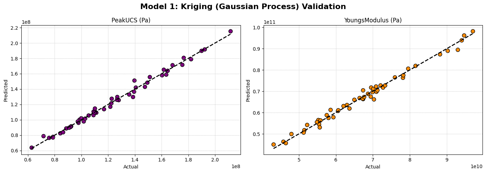
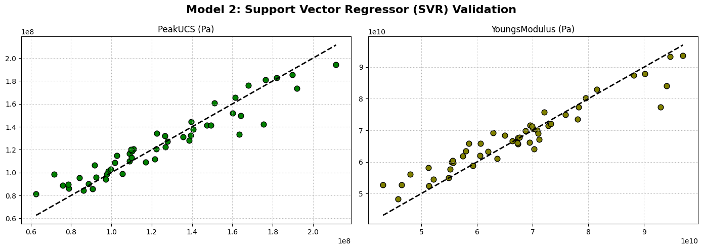
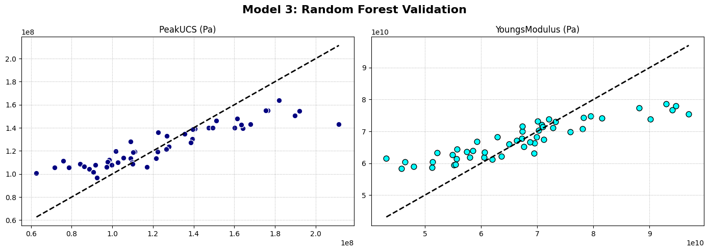
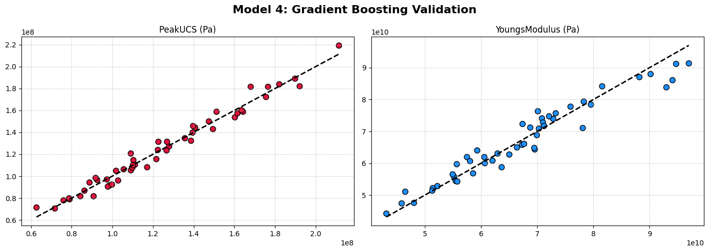
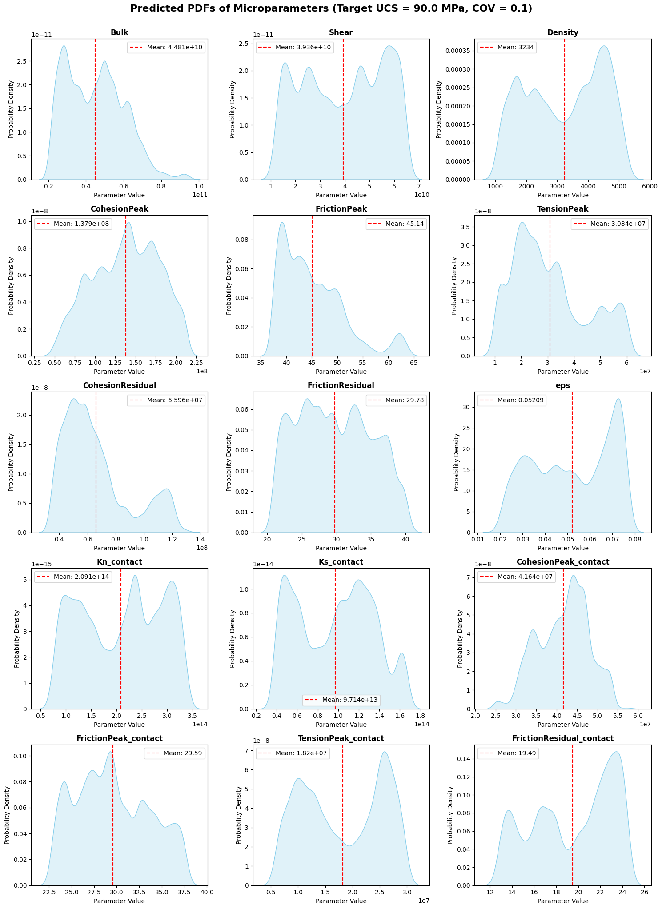

# Rock Strength Modeling & Bayesian Inversion

[](https://opensource.org/licenses/MIT)
[](https://www.python.org/downloads/)
[](https://jupyter.org/)

## 📖 Project Overview
This repository presents a complete Data Science and Machine Learning workflow for estimating and optimizing the microparameters of rock samples to achieve a target Peak Unconfined Compressive Strength (UCS) and Young's Modulus. By leveraging UDEC software for data generation, Response Surface Modeling (Kriging), Global Sensitivity Analysis, and Markov Chain Monte Carlo (MCMC) Bayesian Inversion, this project aims to accurately predict the 15 underlying microparameters for geotechnical modeling.

## 🗂 Repository Structure
```text
Microparameter-Estimation-via-Peak-UCS-Values/
├── data/
│   └── raw/                            # Original datasets (UCS inputs/outputs)
├── notebooks/
│   ├── exploratory/                    # Exploratory analysis and older iterations
│   └── main/                           # Modular workflow notebooks
│       ├── 01_Data_Preparation.ipynb
│       ├── 02_Modeling_Response_Surface.ipynb
│       ├── 03_Sensitivity_Analysis.ipynb
│       ├── 04_Bayesian_Inversion.ipynb
│       └── 05_Inversion_Optimization.ipynb
├── references/                         # Research papers and literature
├── results/
│   └── figures/                        # Generated plots and visualizations
├── src/
│   └── matlab_sensitivity/             # MATLAB scripts for Sensitivity Analysis
├── .gitignore                          
├── LICENSE                             
├── requirements.txt                    
└── README.md                           
```

## 🚀 Methodology Walkthrough

### 1. Data Generation & Preparation
Macro and microparameter values were generated using UDEC software. The data was then cleaned, missing values imputed, and features scaled to prepare for machine learning modeling.

### 2. Response Surface Modeling
Various machine learning models were tested to create a Response Surface, mapping the 15 microparameters to Peak UCS and Young's Modulus. **Gaussian Process Regression (Kriging)** outperformed all other models (SVR, Random Forest, Gradient Boosting), achieving >99% testing NSE.

*Note: Below are the model performance comparisons highlighting Kriging's superiority.*
<br>


### 3. Sensitivity Analysis
To understand which microparameters influence the Peak UCS the most, two Global Sensitivity Analysis techniques were employed:
- **Borgonovo Analysis**
- **Sobol Analysis**

The graphs below illustrate the first-order sensitivity of the microparameters with Peak UCS for both methods, as well as the second-order sensitivity for Sobol.

**First-Order Sensitivity (Borgonovo & Sobol)**
<br>



**Second-Order Sensitivity (Sobol)**
<br>


### 4. Bayesian Inversion via MCMC
Using the Kriging Response Surface, we performed Bayesian Inversion via the Metropolis-Hastings MCMC algorithm (`emcee`). Given a Target UCS (e.g., 90 MPa) and an acceptable Coefficient of Variation (COV), the algorithm predicts the posterior Probability Density Functions (PDFs) of the 15 input microparameters required to achieve that target strength.

**Posterior PDFs of the 15 Microparameters**
<br>


### 5. Inversion Optimization (Current Work)
We are currently working on optimizing the MCMC inversion process to calculate even more accurate deterministic values from the posterior distributions.

## ⚙️ Installation & Usage
1. Clone the repository:
   ```bash
   git clone https://github.com/yourusername/Microparameter-Estimation-via-Peak-UCS-Values.git
   ```
2. Install dependencies:
   ```bash
   pip install -r requirements.txt
   ```
3. Navigate to the `notebooks/main/` folder and execute the notebooks sequentially.

## 📄 License
This project is licensed under the [MIT License](LICENSE).
